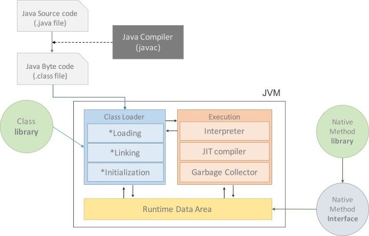

##JVM(Java Virtual Machine)

### 1.JVM이란?
* JVM은 자바를 실행하기 위한 가상 컴퓨터이다.
* JVM은 Java와 Os 사이에서 중개자 역할을 수행하여 재사용이 가능하다.
* JVM은 `메모리관리` 와 `Garbage Collection`을 수행한다.
 
### 2.JVM의 구조
 

#### 클래스 로더(Class Loader)
자바 컴파일러를 사용해서 `.java` 파일을 `.class(바이트코드)` 파일로 컴파일하고 Class Loader를 통해 JVM에
 `.class` 파일을 로드하고 링크를 통해 배치하는 작업을 수행한다.
#### 실행 엔진(Execution Engine)
`.class` 파일을 실행시키는 역할. 클래스 로더가 JVM 내에 Runtime Data Area에 `.class(바이트코드)` 를 배치하고
이를 실행 엔진에 의해 실행된다.

* **Interpreter**  
바이트 코드를 명령어 단위로 읽어서 실행하는 인터프리터. 한 줄씩 수행해서 느리다.

* **JIT (Just-In_Time)**  
JIT 컴파일러는 인터프리터 방식의 단점을 보완하기 위해 도입했다.  
인터프리터 방식으로 실행하다가 적절한 시점에 바이트 코드 전체를 컴파일하여 `네이티브 코드`로 변경하고
이후에는 네이티브 코드를 직접 실행하는 방식이다.

#### 가비지 컬렉션(Garbage Collection)
Gc는 `동적 할당된 메모리 영역(heap)` 중에서 더 이상 사용하지 않는 영역을 탐지하여 `자동 해지` 하는 기법으로 개발자가 메모리를
따로 관리하지 않아도 된다.

#### Runtime Data Area
자바 프로그램을 수행하기 위해 OS에서 할당 받은 메모리 공간을 의미한다.
* JVM stack  
프로그램 실행과정에서 호출된 메서드의 파라미터, 지역변수, 리턴 값 및 연산 값 등이 임시로 저장되는 영역.  

* Heap  
Gc의 대상이 되는 영역. 프로그램 실행 중 생성되는 인스턴스(new 연산자)는 모두 Heap 영역에 생성된다.  
즉 인스턴스변수들이 생성되는 공간.  

* PC Registers  
PC Registers는 Thread가 생성될 때 마다 생기는 공간으로 Thread가 어떠한 명령을 실행하게 될지에 대한 부분을 기록을 한다. 현재의 어떤 명령을 실행해야할 지에 대한 부분을 기록한다.

* Native Method stack  
자바 이외의 이기종 언어에서 제공되는 Method의 정보가 저장 되는 공간, JNI를 통해 표준에 가까운 방식으로 구현이 가능하다.

* Method Area  
프로그램 실행 중 어떤 클래스가 사용되면, JVM은 해당 클래스의 클래스파일(*.class)을 읽어서 분석하여 클래스에 대한 정보(클래스 데이터)를 이곳에 저장한다.

