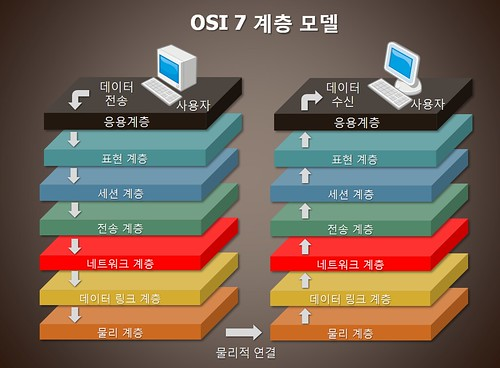

## OSI 7 계층

1. OSI 7계층 이란?

OSI란 개방형 시스템 상호연결 모델로 시스템 상호 연결에 있어 개방 모델을 뜻한다.  
상호 이질적인 네트워크간의 연결에 어려움이 많은데 이러한 호환성 결여를 막기위해 ISO에서 제시한 모델이다.
쉽게 말해 네트워크 통신 과정을 7단계로 나눈 것이다.

## 7계층 - 응용계층 (Application Layer)
사용자가 네트워크에 접근할 수 있도록 해주는 계층이다.
사용자가 인터페이스, 전자우편, 데이터베이스 관리 등 서비스를 제공한다.

- __프로토콜 종류__
- SMTP
- DNS
- FTP
- HTTP

## 6계층 - 표현 계층(Presentation Layer)
운영체계의 한 부분으로 입력 또는 출력되는 데이터를 하나의 표현 형태로 변환한다.  
필요한 번역을 수행하여 두 장치가 일관되게 전송 데이터를 서로 이해할 수 있도록 한다.
제어코드나 문자 및 그래픽 등의 확장자를 생각하면 쉽다.

- __프로토콜 종류__
- JPEG
- MPEG
- SMB
- AFP

## 5계층 - 세션 계층 (Session Layer)
통신장치간의 상호작용을 설정하고 유지하며 동기화한다.
사용자간의 포트연결(세션)이 유효한지 확인하고 설정한다. 통신을 위한 논리적인 연결 단계로 TCP/IP 세션을 만들고 없애는 책임을 짐

- __프로토콜 종류__
- SSH
- TLS

## 4계층 - 전송 계층(Transport Layer)
전체 메세지를 발신지 대 목적지(종단 대 종단)간 제어와 에러를 관리한다.
패킷들의 전송이 유효한지 확인하고 실패한 패킷은 다시 보내는 등 신뢰성있는 통신을 보장하며, 헤드 부분에 세그먼트를 포함한다.  
보내거나/받는 프로세스를 식별하기 위해 부가 데이터(Port)를 추가한ㄷ.

- __프로토콜 종류__
- TCP
- UDP

## 3계층 - 네트워크 계층(Newtowrk Layer)
다중 네트워크 링크에서 패킷을 발신지로부터 목적지로 전달한 책임을 갖는다.  
데이터를 목적지까지 가장 안전하고 빠르게 전달하기 위한 라우팅 기능.  
IP 주소를 정하고 경로에 따라 패킷을 전달해준다.

