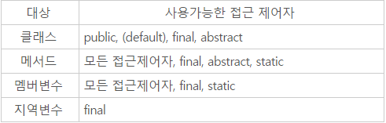

## 제어자

### 1.제어자란
제어자(modifier)는 클래스, 변수, 메서드 선언부에 함께 사용되며 부가적 의미를 부여함.

```
접근 제어자 : public, protected, default, private
그 외 : static, final, abstract, native, transient, synchronized, volatile, strictfp
```

### 2.static - 클래스의 공통적인
인스턴스변수는 하나의 클래스로부터 생성되었더라도 각기 다른 값을 유지하지만 클래스변수(static)는 인스턴스에 관계없이 같은 값을 갖음.
그 이유는 모든 인스턴스가 공유하기 떄문이다.
* 인스턴스 멤버를 사용하지 않는 메서드는 static을 붙혀서 static메서드로 선언 할 것
* static 메서드로 하는 것이 인스턴스를 생성하지 않고도 호출이 가능해서 더 편리하고 속도도 빠름

### 3.abstract - 추상, 미완성
abstract이 사용 되는 곳은 - 클래스, 메서드
* abstract class : 클래스 내에 추상 메서드가 선언되있음을 의미함.
* abstract method : 선언부만 작성하고 구현부는 아직 작성하지 않은 추상 메서드임을 의미함.
```
abstract class AbstractTest {  // 추상클래스(추상메서드를 포함한 클래스)
    abstract void move();      // 추상 메서드(구현부가 없는 메서드)
}
```
다른 클래스가 이 클래스를 상속 받아서 원하는 메서드만 오버라이딩 해도 된다는 장점이 있음

### 4.접근 제어자
```
접근 제어자가 사용될 수 있는 곳 - 클래스, 멤버변수, 메서드, 생성자
private : 같은 클래스 내에서만 접근이 가능하다.
default : 같은 패키지 내에서만 접근이 가능하다.
protected : 같은 패키지 내에서, 그리고 다른 패키지의 자손 클래스에서 접근이 가능하다.
public : 접근 제한이 전혀 없다.
```

### 5. 제어자 조합
대상에 따라 사용 할 수 있는 제어자  


```
1. 메서드에 static과 abstract를 함께 사용할 수 없다.
    - static 메서드는 몸통이 있는 메서드에만 사용할 수 있기 때문이다.
2. 클래스는 abstract와 final을 동시에 사용할 수 없다.
    - 클래스에 사용되는 final은 클래스를 확장할 수 없다는 의미이고, abstract는 상속을 통해서 완성되어야 한다는 의미이므로 서로 모순되기 때문이다.
3. abstract메서드는 접근 제어자가 private일 수 없다.
    - abstract메서드는 자손클래스에서 구현해주어야 하는데 접근 제어자가 private이면, 자손 클래스에서 접근할 수 없기 때문이다.
4. 메서드에 private과 final을 같이 사용할 필요는 없다.
    - 접근 제어자가 private인 메서드는 오버라이딩될 수 없기 때문이다.
```